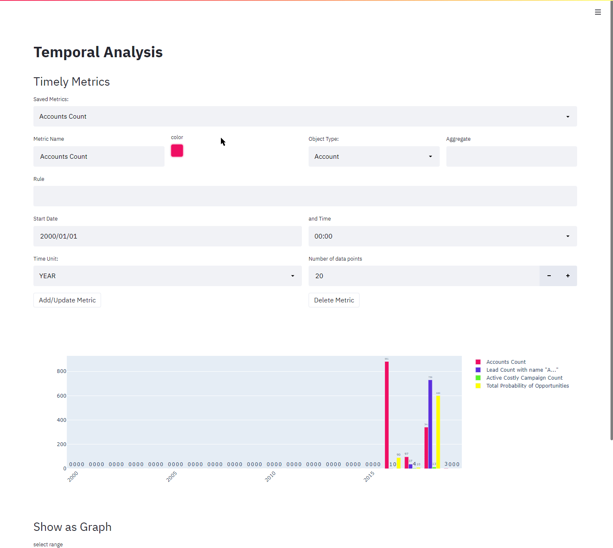

# Temporal Analysis

This project is built for [TigerGraph Web App Hack](https://tigergraph-web-app-hack.devpost.com/). Mainly it is a tool for making time-based custom metrics with [TigerGraph database](https://www.tigergraph.com/). Take a look at [the hackathon submission](https://devpost.com/software/temporal-analysis) for detailed introduction.

## Snapshot

    

## Config

It needs [tg_config.json](tg_config.json) to get data from tigergraph database and to understand the lifetime properties of object types.

## Quick Start

Run `streamlit run main.py`

## Dependencies

Mainly I used Python 3, [streamlit](https://streamlit.io/), [graphistry](https://pypi.org/project/graphistry/). It also imports some other python libraries (pandas, requests) which all can be installed with [pip](https://pypi.org/project/pip/).
